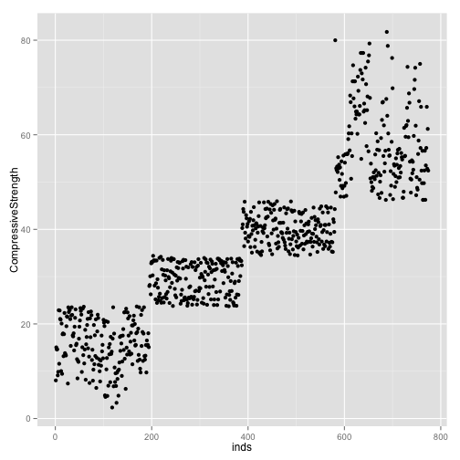
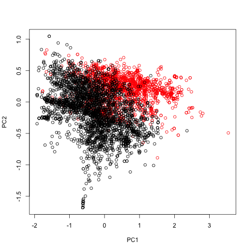

### Using caret (overview)

```r
library(caret)
```
The caret package wraps around many of the prediction algos. that we'll be using with R. 
It allows for 

* preprocessing
* data splitting (for training and test sets)
* training and testing functions
* model comparison


```r
library(kernlab); data(spam)
# partition the data into a training and test set
inTrain<-createDataPartition(y = spam$type, 
                             p = 0.75, 
                             list = F)
# subset the data into the training data
training<-spam[inTrain, ]
# the remainder goes into testing
testing<-spam[-inTrain, ]
dim(training)
```

```
## [1] 3451   58
```

```r
set.seed(32343)
# fit a model with train(). ~. means use all other variables to predict type  
modelFit<-train(type ~., data = training, method = "glm")
modelFit
```

```
## Generalized Linear Model 
## 
## 3451 samples
##   57 predictor
##    2 classes: 'nonspam', 'spam' 
## 
## No pre-processing
## Resampling: Bootstrapped (25 reps) 
## 
## Summary of sample sizes: 3451, 3451, 3451, 3451, 3451, 3451, ... 
## 
## Resampling results
## 
##   Accuracy  Kappa  Accuracy SD  Kappa SD
##   0.9       0.8    0.007        0.01    
## 
## 
```

```r
# view the model. returns the fitted values
modelFit$finalModel
```

```
## 
## Call:  NULL
## 
## Coefficients:
##       (Intercept)               make            address  
##          -1.58055           -0.38340           -0.13420  
##               all              num3d                our  
##           0.12952            2.01935            0.44989  
##              over             remove           internet  
##           1.02766            2.38960            0.55032  
##             order               mail            receive  
##           0.35598            0.15247           -0.38467  
##              will             people             report  
##          -0.15499           -0.17126            0.34041  
##         addresses               free           business  
##           1.06815            0.93512            0.92469  
##             email                you             credit  
##           0.22164            0.09577            0.75132  
##              your               font             num000  
##           0.29324            0.30617            2.65959  
##             money                 hp                hpl  
##           0.27502           -1.91593           -0.73116  
##            george             num650                lab  
##         -10.45024            0.38352           -2.32722  
##              labs             telnet             num857  
##          -0.20734           -6.82275            1.32297  
##              data             num415              num85  
##          -0.98244            0.72314           -1.99610  
##        technology            num1999              parts  
##           0.79867            0.01408           -0.57177  
##                pm             direct                 cs  
##          -0.72066           -0.12270          -46.33894  
##           meeting           original            project  
##          -2.22381           -1.03793           -1.52340  
##                re                edu              table  
##          -0.94378           -1.30414           -2.52196  
##        conference      charSemicolon   charRoundbracket  
##          -4.83389           -1.66914           -0.09037  
## charSquarebracket    charExclamation         charDollar  
##          -0.96496            0.28523            4.81290  
##          charHash         capitalAve        capitalLong  
##           2.31546            0.01759            0.00636  
##      capitalTotal  
##           0.00124  
## 
## Degrees of Freedom: 3450 Total (i.e. Null);  3393 Residual
## Null Deviance:	    4630 
## Residual Deviance: 1360 	AIC: 1480
```

```r
# use the model to predict on new samples
predictions<-predict(object = modelFit, newdata = testing)
head(predictions)
```

```
## [1] spam spam spam spam spam spam
## Levels: nonspam spam
```

```r
# to evaluate whether your model fit well or not, use
confusionMatrix(data = predictions, testing$type)
```

```
## Confusion Matrix and Statistics
## 
##           Reference
## Prediction nonspam spam
##    nonspam     666   55
##    spam         31  398
##                                        
##                Accuracy : 0.925        
##                  95% CI : (0.908, 0.94)
##     No Information Rate : 0.606        
##     P-Value [Acc > NIR] : <2e-16       
##                                        
##                   Kappa : 0.842        
##  Mcnemar's Test P-Value : 0.0131       
##                                        
##             Sensitivity : 0.956        
##             Specificity : 0.879        
##          Pos Pred Value : 0.924        
##          Neg Pred Value : 0.928        
##              Prevalence : 0.606        
##          Detection Rate : 0.579        
##    Detection Prevalence : 0.627        
##       Balanced Accuracy : 0.917        
##                                        
##        'Positive' Class : nonspam      
## 
```
### Quiz 2 #1
Question 1
Load the Alzheimer's disease data using the commands:
```
library(AppliedPredictiveModeling)
library(caret)
data(AlzheimerDisease)
```
Which of the following commands will create training and test sets with about 50% of the observations assigned to each?
```
adData = data.frame(diagnosis,predictors)
trainIndex = createDataPartition(diagnosis, p = 0.50)
training = adData[trainIndex,]
testing = adData[-trainIndex,]
```
```
adData = data.frame(predictors)
trainIndex = createDataPartition(diagnosis,p=0.5,list=FALSE)
training = adData[trainIndex,]
testing = adData[-trainIndex,]
```
```
adData = data.frame(diagnosis,predictors)
train = createDataPartition(diagnosis, p = 0.50,list=FALSE)
test = createDataPartition(diagnosis, p = 0.50,list=FALSE)
```
```
adData = data.frame(diagnosis,predictors)
trainIndex = createDataPartition(diagnosis, p = 0.50,list=FALSE)
training = adData[trainIndex,]
testing = adData[-trainIndex,]
```

Answer: The data partition is created by calling 
```createDataPartition(y = <data$response>, p = <partition size>, list = F)``` *once*, assigning the partitioned data to the training set, and the remainder to the testing set. The third option calls createDataPartition() twice; it can be eliminated. By default, list is T, so by not assigning it, option one can be eliminated. To choose between options two and four, examine the dataset


```r
library(AppliedPredictiveModeling)
library(caret)
data(AlzheimerDisease)
head(diagnosis)
```

```
## [1] Control  Control  Control  Control  Control  Impaired
## Levels: Impaired Control
```

```r
#head(predictors)
```
The result of ```head(predictors)``` is suppressed because it is huge. Diagnostics only tells us whether the individual is impared or in the control group; but itself, this information cannot be used to build a predictor. Option 4 is correct. 


### Data Slicing

1. createDataPartition  
Used to 

* build training and test data sets right at the beginning of the prediction function 
* perform cross validation or prediction within your data set

This is performed by the createDataPartion() function. You tell it what data you want to split on (y), percentage split (p)

2. K-folding
For the purpose of cross validation, you may also want to split your data set into several smaller data sets. K folds are one cross validation method. createFolds() created these folds. 

```r
set.seed(32323)
# returnTrain = T returns the test set, =F returns the training set
folds=createFolds(y = spam$type, k = 10, list = T, returnTrain = T)
sapply(folds, length)
```

```
## Fold01 Fold02 Fold03 Fold04 Fold05 Fold06 Fold07 Fold08 Fold09 Fold10 
##   4141   4140   4141   4142   4140   4142   4141   4141   4140   4141
```

```r
# to view which elements are in the folds
folds[[1]][1:20] # elements you want to examine
```

```
##  [1]  1  2  3  4  5  6  7  8  9 10 11 12 13 14 15 16 17 18 19 20
```

```r
folds=createFolds(y = spam$type, k = 10, list = T, returnTrain = F)
sapply(folds, length)
```

```
## Fold01 Fold02 Fold03 Fold04 Fold05 Fold06 Fold07 Fold08 Fold09 Fold10 
##    460    459    460    460    460    460    460    460    461    461
```

3. Re-sampling

```r
folds<-createResample(y = spam$type, times = 10, list = T)
sapply(folds, length)
```

```
## Resample01 Resample02 Resample03 Resample04 Resample05 Resample06 
##       4601       4601       4601       4601       4601       4601 
## Resample07 Resample08 Resample09 Resample10 
##       4601       4601       4601       4601
```

4. Create Time Slices

```r
set.seed(32323)
time<-1:1000
folds<-createTimeSlices(y = time, initialWindow = 20, horizon = 10)
names(folds)
```

```
## [1] "train" "test"
```

```r
folds$train[[1]]
```

```
##  [1]  1  2  3  4  5  6  7  8  9 10 11 12 13 14 15 16 17 18 19 20
```

```r
folds$test[[1]]
```

```
##  [1] 21 22 23 24 25 26 27 28 29 30
```

### Plotting predictors

One of the most important components of building a machine learning algorithm or prediction model is understanding how the data look, and how the data interact with each other.   
One of the best ways to achieve this is to plot the data, and in particular the predictors. 
Look for 

* Imbalance in outcomes/predictors: if you see all predictors being one value in one outcome group, but not another, then, you see that you have a good predictor, but only say 3 in one outcome and 150 in another shows that you are going to have a hard time building an accurate predictor between those two classes
* Outliers 
* Groups of points not explained by predictor
* Skewed Variables

```r
require(ISLR)
require(gridExtra)
data(Wage)
summary(Wage)
```

```
##       year           age              sex                    maritl    
##  Min.   :2003   Min.   :18.0   1. Male  :3000   1. Never Married: 648  
##  1st Qu.:2004   1st Qu.:33.8   2. Female:   0   2. Married      :2074  
##  Median :2006   Median :42.0                    3. Widowed      :  19  
##  Mean   :2006   Mean   :42.4                    4. Divorced     : 204  
##  3rd Qu.:2008   3rd Qu.:51.0                    5. Separated    :  55  
##  Max.   :2009   Max.   :80.0                                           
##                                                                        
##        race                   education                     region    
##  1. White:2480   1. < HS Grad      :268   2. Middle Atlantic   :3000  
##  2. Black: 293   2. HS Grad        :971   1. New England       :   0  
##  3. Asian: 190   3. Some College   :650   3. East North Central:   0  
##  4. Other:  37   4. College Grad   :685   4. West North Central:   0  
##                  5. Advanced Degree:426   5. South Atlantic    :   0  
##                                           6. East South Central:   0  
##                                           (Other)              :   0  
##            jobclass               health      health_ins      logwage    
##  1. Industrial :1544   1. <=Good     : 858   1. Yes:2083   Min.   :3.00  
##  2. Information:1456   2. >=Very Good:2142   2. No : 917   1st Qu.:4.45  
##                                                            Median :4.65  
##                                                            Mean   :4.65  
##                                                            3rd Qu.:4.86  
##                                                            Max.   :5.76  
##                                                                          
##       wage      
##  Min.   : 20.1  
##  1st Qu.: 85.4  
##  Median :104.9  
##  Mean   :111.7  
##  3rd Qu.:128.7  
##  Max.   :318.3  
## 
```
The summary already tells us some interesting things about the data, such as the fact that all the interviewees are men, and that they all come from the mid-Atlantic.

As always, **before doing any exploration** we build a training and test set. The test set is set aside until we are past the model building experience. 

```r
inTrain<-createDataPartition(y = Wage$wage, p =0.7, list = F)
training<-Wage[inTrain, ]
testing<-Wage[-inTrain, ]
```
To view all of the features against one another, use featurePlot(). We seek any variable that seems to show a relationship with the y variable (look at the first three elements of the top row). WE can see, for example, that there seems to be some positive trend with education and salary. 

```r
featurePlot(x = training[,c("age", "education", "jobclass")], 
            y = training$wage, 
            plot = "pairs")
```

 
Visualizing data can be accomplished with qplot. We are looking for patterns, such as the positive trend between age and wages below, and separation of the data into two chunks below.   

```r
require(ggplot2)
qplot(x = age, y = wage, data = training)
```

 
We should try to account for irregularities in the data **before** we build our model. The seperation of the data into two distinct groups is one exaple of of an irregularity that needs to be accounted for. If we colour the plot by different variables, we can sometimes understand these patterns better. The upper cluster in the above graph all represent jobs that belong to the information class, which may explain a lot of the difference between these classes of observation. For example, we can theorize that there within this age group, there there are some jobs which offer a disproportionatly higher wage, and that most of these jobs are information based. 

```r
require(ggplot2)
qplot(x = age, y = wage, data = training, col=jobclass)
```

 
You should explore every avenue for explaining the patterns of the data. Below is the same plot coloured by education. Adding regression smoothers will fit a linear model to every different education class. This allows us to determine if there is a different relationship for different age groups.Here we see that for all educational levels, there is a slight positive relationship between seniority and wage

```r
qq<-qplot(x = age, y = wage, color =education, data = training)
qq + geom_smooth(method = "lm", formula = y~x)
```

 
If it apprears that different categories of data have differnt relationships, the data can be broken apart and examined seperately. Breaking numerical into categorical variables allows us to examine the data in different ways with different kinds of plots or tables. 

```r
require(Hmisc)
cutWage<-cut2(training$wage, g=3)
table(cutWage)
```

```
## cutWage
## [ 20.1, 91.7) [ 91.7,118.9) [118.9,318.3] 
##           703           721           678
```

```r
p1<-qplot(x = cutWage, 
          y = age, 
          data = training, 
          fill=cutWage, 
          geom=c("boxplot")); p1
```

 
You can actually add the points themselves over the boxplots. This reveals the number of points, which are usually hidden by the boxplot

```r
p2<-qplot(cutWage, age, 
          data = training, 
          fill=cutWage, 
          geom=c("boxplot", "jitter")); p2
```

 

```r
grid.arrange(p1, p2, ncol=2)
```

 
Covering the boxplots with the points tells us if the boxplot is representative: if any box is covered by only a few data points, we can assume that that box does not represent what the data actually look like.   

Tabling data can also be accomplished with cut(). 

```r
# create table
t1<-table(cutWage, training$jobclass); t1
```

```
##                
## cutWage         1. Industrial 2. Information
##   [ 20.1, 91.7)           437            266
##   [ 91.7,118.9)           373            348
##   [118.9,318.3]           274            404
```

```r
# proportions in each row
prop.table(t1,1)
```

```
##                
## cutWage         1. Industrial 2. Information
##   [ 20.1, 91.7)        0.6216         0.3784
##   [ 91.7,118.9)        0.5173         0.4827
##   [118.9,318.3]        0.4041         0.5959
```

Density plots for  values of continuous predictors. Density plots often show things that boxplots do not, such as the modality

```r
qplot(x = wage, color = education, data = training, geom = "density")
```

 

### Quiz 2 #2
Load the cement data using the commands:

```r
library(AppliedPredictiveModeling)
data(concrete)
library(caret)
set.seed(975)
inTrain = createDataPartition(mixtures$CompressiveStrength, p = 3/4)[[1]]
training = mixtures[ inTrain,]
testing = mixtures[-inTrain,]
```
Make a plot of the outcome (CompressiveStrength) versus the index of the samples. Color by each of the variables in the data set (you may find the ```cut2()``` function in the Hmisc package useful for turning continuous covariates into factors). What do you notice in these plots?
```
1. The outcome variable is highly correlated with FlyAsh.
2. The data show a step like pattern that is perfectly explained by the FlyAsh variable so there may be a variable missing.
3. There is a step-like pattern in the plot of outcome versus index in the training set that isn't explained by any of the predictor variables so there may be a variable missing.
4. The data show a step like pattern that is perfectly explained by the Age variable.
```


```r
require(Hmisc)
inds<-1:nrow(training)
# view step pattern in plot
q<-qplot(x = inds, y = CompressiveStrength, data = training); q
```

 

```r
# apply a cut to all the columns of the training data
nameslist<-names(training)
cutall<-sapply(nameslist, function(nameslist){
        cut2(training[[nameslist]], g=5)
})
cutall<-as.data.frame(cutall)
cutnames<-sapply(nameslist, function(nameslist){paste("cut", nameslist, sep="")})
colnames(cutall)<-cutnames
# plot the data coloured by the cuts in each of the variables 
for(Var in names(cutall)) {
        print(qplot(x = inds, y = CompressiveStrength, data=training, color=cutall[[Var]], main = Var))
}
```

         
If the data were strongly correlated with any variable, we could expect that each step would mostly be colored by one cut for that variable, similar to the cutCompressiveStrength plot. This colour pattern is to be expected, because of course the CompressiveStrength would correlate strongly with itself. This is not the case for any of the varibales, however, and we have coloured all of them. We conclude that a variable may be missing. 

### Basic PreProcessing
To review the process so far

* Split the data into training and test sets, and set the test set aside
* Conduct an exploratory data analysis (ie. plot the predictors right upfront, so that we can see if there is any weird behaviour in those variables).

The next step is to preprocess the predictor variables. We do this when the predictors which you have plotted  look very strange (or are distributed strangely), and need to be transformed before they can be used in prediction algorithms. 

This step is particularly important when using model-based algorithms (as oppesed to non-parametric approaches), like linear discriminant analysis, linear regression, etc. 

```r
## From-the-top example
# 1. get and partition the data
library(kernlab); data(spam)
# partition the data into a training and test set
inTrain<-createDataPartition(y = spam$type, 
                             p = 0.75, 
                             list = F)
# subset the data into the training data
training<-spam[inTrain, ]
# the remainder goes into testing
testing<-spam[-inTrain, ]
# 2. Do an exploratory data analysis
hist(training$capitalAve, main ="", xlab="capital ave run length")
```

 
This is an example of a variable that is very skewed, and is hard to deal with in model based predictors, and should be preprocessed

```r
c(mean(training$capitalAve), sd(training$capitalAve))
```

```
## [1]  4.718 21.455
```
The standard deviation is *huge*. We need to preprocess so that the machine learning algorithms don't get tricked by the fact that this variable is skewed and highly variable. 
One way that this could be done is with **Standarizing**
$$\frac{x-\bar{x}}{s_x}$$

```r
trainCapAve<-training$capitalAve
trainCapAveS<-(trainCapAve-mean(trainCapAve))/sd(trainCapAve)
c(mean(trainCapAveS), sd(trainCapAveS))
```

```
## [1] 3.666e-18 1.000e+00
```
The mean of the variable is now approximately 0, and the standard deviation 1, which has reduced a lot of the variability that we saw previously. 

**Caveat!!!**
```
When we apply a prediction algorithm to the **test** set, we must remember that we can only use parameters that we have estimated in the **training** set. In other words, when we apply the same standardization to the test set, we need to use the mean and standard deviation from the training set
```

```r
testCapAve<-testing$capitalAve
#standardization with the mean and sd of the training set
testCapAveS<-(testCapAve-mean(trainCapAve))/sd(trainCapAve)
c(mean(testCapAveS), sd(testCapAveS))
```

```
## [1] 0.08826 2.39736
```
The mean will not be exactly 0 in the test set, not the training set exactly 1, because we have standarized by parameters estimated in the training set, but hopefully they'll be close to those values.
The **preProcess()** function can handle a lot of the standardization for you, and help you avoid errors that come from having to do these by hand. 

```r
preObj<-preProcess(training[,-58], method=c("center", "scale"))
preObj
```

```
## 
## Call:
## preProcess.default(x = training[, -58], method = c("center", "scale"))
## 
## Created from 3451 samples and 57 variables
## Pre-processing: centered, scaled
```

```r
trainCapAve<-predict(preObj, training[,-58])$capitalAve
#check that mean and sd are the same as calculated by hand
c(mean(trainCapAve), sd(trainCapAve))
```

```
## [1] 3.666e-18 1.000e+00
```
The preprocessing object that was created can be used to preprocess the test set.


```r
# preObj is the object we created by preprocessing the training set. If we pass the testing set to the predict function, the predict function will take the values calculated in the preprocessing step and apply them to the test set object
testCapAveS<-predict(preObj, testing[,-58])$capitalAve
# check that mean and sd are the same as calculated by hand
c(mean(testCapAveS), sd(testCapAveS))
```

```
## [1] 0.08826 2.39736
```

Alternatively, the preProcess command can be accepted by the train() function as an argument. The following example centers and scales all the predictors before passing them to the prediction model. 

```r
set.seed(32323)
modelFit<-train(type ~., 
                data =training, 
                preProcess=c("center", "scale"), 
                method ="glm")
modelFit
```

```
## Generalized Linear Model 
## 
## 3451 samples
##   57 predictor
##    2 classes: 'nonspam', 'spam' 
## 
## Pre-processing: centered, scaled 
## Resampling: Bootstrapped (25 reps) 
## 
## Summary of sample sizes: 3451, 3451, 3451, 3451, 3451, 3451, ... 
## 
## Resampling results
## 
##   Accuracy  Kappa  Accuracy SD  Kappa SD
##   0.9       0.8    0.006        0.01    
## 
## 
```

Standardizing is only one of several preprocessing techniques. Another kind of transformation is the BoxCox transform, which takes continuous data and tries to make them look like normal data. 

```r
preObj<-preProcess(x = training[,-58], method = "BoxCox")
trainCapAveS<-predict(preObj, training[,-58])$capitalAve
par(mfrow=c(1,2)); hist(trainCapAveS); qqnorm(trainCapAveS)
```

 

Another standardization technique is the imputation of data. It is very common to have missing data, and when using data with missing values in prediction algorithms, the algorithms often fail, as they are not built to handle missing values. 

**K-Nearest Neighbours Imputation**

```r
set.seed(13343)

# make some values NAs
training$capAve<-training$capitalAve
selectNA<-rbinom(n = dim(training)[1], size = 1, prob = 0.05)==1
training$capAve[selectNA]<-NA

# Impute missing values and standardize
preObj<-preProcess(x = training[,-58], method = "knnImpute")
# predict on the training set all the new values, including those that have been imputed
capAve<-predict(preObj, training[,-58])$capAve

# standardize values
capAveTruth<-training$capitalAve
capAveTruth<-(capAveTruth-mean(capAveTruth))/sd(capAveTruth)
```
### Quiz2 #3
Load the cement data using the commands:

```r
library(AppliedPredictiveModeling)
data(concrete)
library(caret)
set.seed(975)
inTrain = createDataPartition(mixtures$CompressiveStrength, p = 3/4)[[1]]
training = mixtures[ inTrain,]
testing = mixtures[-inTrain,]
```
Make a histogram and confirm the SuperPlasticizer variable is skewed. Normally you might use the log transform to try to make the data more symmetric. Why would that be a poor choice for this variable?
```
1. There are values of zero so when you take the log() transform those values will be -Inf.
2. The log transform does not reduce the skewness of the non-zero values of SuperPlasticizer
3. The log transform produces negative values which can not be used by some classifiers.
4. The log transform is not a monotone transformation of the data.
```

```r
hist(training$Superplasticizer)
```

 
1 is resonable. 2 is clearly incorrect. Since all the values are non-negative, 3 is also incorrect.  A function $f$ defined on a subset of the real numbers with real values is called *monotonic* if it is either entirely nonincreasing or nondecreasing. $\log(\cdot)$ is a monotonic function. The answer is 1. 


### Covariate creation

Covariates are sometimes called predictors or features. They are the variables that are included in your model to be combined to predict whatever you care about. There are two levels of feature creation

1. taking the raw data that you have and turning it into a predictor that you can use
2. Transforming tidy covariates

The first step turns the raw data into data that you can use. The raw data can take the form of an image, or an email, or a website, and that sort of data is impossible to build a predictive model around. The data must be summarized into a quantitative or a qualitative variable. We turn the raw data into covariates, which are variables that describe the data as much as possible, while giving some compression. This step requires thinking about the structure of the data that you have and the most appropriate way of extracting the most number of variables from it that captures everything that you want.   
The second step takes the features from the previous step and transform them into more useful variables.  

Step 1 

* depends heavily on the application (eg: in email, it may be extracting the number of times that a particular word appears)
* needs to balance summarization vs information loss (the best features are those that capture the relavant information in the data, and throw out the rest)
* the more knowledge of the system that you have, the better a job you will do 
*when in doubt, err on the side of more features
*can be automated, but **use caution!**

Step2

* is more necesary for some methods (regression, svms) than for others (classification trees)
* should be done only on the training set 
* the best approach is through exploratory analysis (make lots of plots and tables)
* New covariates must be added to dataframes

eg

```r
data(Wage)
inTrain<-createDataPartition(y = Wage$wage, 
                             p = 0.7, 
                             list = F)
training<-Wage[inTrain, ]
testing<-Wage[-inTrain,]
```

_Common technique 1: Turning (qualitative/) factor variables into dummy variables_
This converts factor variables into indicator variables

```r
table(training$jobclass)
```

```
## 
##  1. Industrial 2. Information 
##           1069           1033
```
This may be useful for creating a predictor model, but not in its current form, because the values of the variable jobclass are characters "Industrial" or "Information". In the caret package, dummyVars() converts these into an indicator

```r
dummies<-dummyVars(formula = wage~jobclass, 
                   data = training)
head(predict(object = dummies, newdata = training))
```

```
##        jobclass.1. Industrial jobclass.2. Information
## 11443                       0                       1
## 305706                      1                       0
## 160191                      1                       0
## 11141                       0                       1
## 448410                      1                       0
## 86064                       1                       0
```

_Common technique 2: removing zero covariates_

Sometimes, some of the variables have no variability in them. A (silly) example of this is creating a feature for spam prediction that summarizes if the email has any letters in it at all. That variable will always be equal to T, so it has no variablity, and is probably not going to be a useful covariate.   
To weed out those variables that have close to 0 variablity, and are unlikely to be good predictors, use nearZeroVar() in the caret package

```r
nearZeroVar(x = training, saveMetrics = T)
```

```
##            freqRatio percentUnique zeroVar   nzv
## year           1.003       0.33302   FALSE FALSE
## age            1.072       2.90200   FALSE FALSE
## sex            0.000       0.04757    TRUE  TRUE
## maritl         3.213       0.23787   FALSE FALSE
## race           8.473       0.19029   FALSE FALSE
## education      1.339       0.23787   FALSE FALSE
## region         0.000       0.04757    TRUE  TRUE
## jobclass       1.035       0.09515   FALSE FALSE
## health         2.527       0.09515   FALSE FALSE
## health_ins     2.190       0.09515   FALSE FALSE
## logwage        1.084      17.22169   FALSE FALSE
## wage           1.072      18.64891   FALSE FALSE
```
The sex and region variables show 0 variability, and should be excluded from the prediction model. 

_Common technique 3: Spline Basis_
If you do (generalized) linear regression, the idea is to fit straight lines through the data. Sometimes, you will need to be able to fit curvy lines, and one way to do that is with a basis function, which creates a polynomial variable. For example, if we want a third degree polynomial for the age variable in the training set, the first output is age, the second age^2 and the third age^3


```r
require(splines)
bsBasis<-bs(x = training$age, df = 3)
head(bsBasis)
```

```
##            1      2       3
## [1,] 0.36253 0.3867 0.13749
## [2,] 0.42617 0.1482 0.01719
## [3,] 0.44222 0.1954 0.02878
## [4,] 0.44309 0.2437 0.04468
## [5,] 0.01794 0.2045 0.77705
## [6,] 0.42617 0.1482 0.01719
```

eg: Fitting Curves with Splines

```r
lm1<-lm(formula = wage~bsBasis,data = training)
plot(x = training$age, y = training$wage, pch=19, cex=0.5)
points(x = training$age, predict(object = lm1, newdata = training), col="red", pch=19, cex = 0.5)
```

 

On the test set, we will have to predict the same variables. Remember that the covariates are created on the test data set, *using the exact same procedure that was used on the training set*


```r
head(predict(object = bsBasis, newdata = testing$age))
```

```
##            1      2       3
## [1,] 0.36253 0.3867 0.13749
## [2,] 0.42617 0.1482 0.01719
## [3,] 0.44222 0.1954 0.02878
## [4,] 0.44309 0.2437 0.04468
## [5,] 0.01794 0.2045 0.77705
## [6,] 0.42617 0.1482 0.01719
```

### Pre-processing with Principal Components Analysis (PCA)
Often we will have multiple quantitative variables which will be highly correlated with each other. Because of this, they act as if they are the exact same variable. In this case, it may not be useful to include all variables in the model; you might want to include some summary that captures most of the information in those quantitative variables. 

_Identifying Correlated Predictors_

```r
library(kernlab); data(spam)
# partition the data into a training and test set
inTrain<-createDataPartition(y = spam$type, 
                             p = 0.75, 
                             list = F)
# subset the data into the training data
training<-spam[inTrain, ]
# the remainder goes into testing
testing<-spam[-inTrain, ]
#calculate the correlation between all colums (except the last one, which is what we want to predict)
M<-abs(cor(training[,-58]))
# every variable has a corelation 1 with itself, so we set these to 0 before we identify which have high correlations
diag(M)<-0
# identify the variables that have a high correlation with each other
which(x = M > 0.8, arr.ind = T)
```

```
##        row col
## num415  34  32
## direct  40  32
## num857  32  34
## direct  40  34
## num857  32  40
## num415  34  40
```

```r
names(spam)[c(32,34,40)]
```

```
## [1] "num857" "num415" "direct"
```

```r
par(mfrow=c(1,3))
plot(spam[,32], spam[,34])
plot(spam[,32], spam[,40])
plot(spam[,34], spam[,40])
```

 
We can see from the plots that these variables lie almost prefectly on a straight line. So including all of them in the model is not going to be very useful. We want to be able to take these variables and convert them into a single variable that's better. 

_Basic PCA Idea_

* We may not need every predictor
* A weighted combination of predictors may be better
* We should pick this combination to capture the most information possible
This leads to
* a reduced number of predictors
* reduced noise

We can see how this works by rotating the plot. Let
$$
\begin{aligned}
X&=0.71\times num415 + 0.71 \times num857
Y&=0.71\times num415 - 0.71 \times num857
\end{aligned}
$$

```r
X<-0.71*training$num415 +0.71*training$num857
Y<-0.71*training$num415 -0.71*training$num857
plot(X,Y)
```

 
What we observe is that most of the variability is captured by the X axis, which is the sum. In contrast, most of the points are clustered at 0 on the Y axis. So, adding the two variables captures most of the information in those two variables, while subtracting the variables captures less information. Thus we would use the weighted sum of the variables as a predictor.  

_How to do this in a more general sense_

Let $X$ be a matrix with a variable in each column and an observation in each row (precisely like a dataframe in R). The SVD is
$$X=UDV^T$$
where U is the matrix of left singular vectors, V is the matrix of right singular vectors, and D is a diagonal matrix  
The PCA is the same as the right singular values if you first scale the variables (subtract the mean and divide by the sd)  
This is accomplished by prcomp() in R

```r
smallspam<-spam[, c(32, 34)]
prComp<-prcomp(smallspam)
plot(prComp$x[,1], prComp$x[,2])
```

 

_PCA on Spam data_

```r
# colour red if spam, black else
typeColour<-((spam$type=="spam")*1 + 1)
# perform pca. Some of the variables are skewed, so we take a log10 transformation of the data
prComp<-prcomp(x = log10(spam[-58]+1))
plot(prComp$x[,1], prComp$x[,2], col=typeColour, xlab="PC1", ylab="PC2")
```

 

_PCA in caret_

```r
preProc<-preProcess(x = log10(spam[,-58]+1), method = "pca", pcaComp = 2)
spamPC<-predict(object = preProc, newdata = log10(spam[,-58]+1))
plot(spamPC[,1], spamPC[,2], col=typeColour)
```

 
### Quiz 2 #4
Load the Alzheimer's disease data using the commands:

```r
library(caret)
library(AppliedPredictiveModeling)
set.seed(3433)
data(AlzheimerDisease)
adData = data.frame(diagnosis,predictors)
inTrain = createDataPartition(adData$diagnosis, p = 3/4)[[1]]
training = adData[ inTrain,]
testing = adData[-inTrain,]
```
Find all the predictor variables in the training set that begin with IL. Perform principal components on these variables with the preProcess() function from the caret package. Calculate the number of principal components needed to capture 80% of the variance. How many are there?
```
8
10
12
7
```

```r
inds<-grep(pattern = "^IL", x = names(training))
names(training)[inds]
```

```
##  [1] "IL_11"         "IL_13"         "IL_16"         "IL_17E"       
##  [5] "IL_1alpha"     "IL_3"          "IL_4"          "IL_5"         
##  [9] "IL_6"          "IL_6_Receptor" "IL_7"          "IL_8"
```

```r
preProc<-preProcess(x = training[, inds], method="pca", thresh = 0.8)
preProc
```

```
## 
## Call:
## preProcess.default(x = training[, inds], method = "pca", thresh = 0.8)
## 
## Created from 251 samples and 12 variables
## Pre-processing: principal component signal extraction, scaled, centered 
## 
## PCA needed 7 components to capture 80 percent of the variance
```

### Quiz 2 #5 
Load the Alzheimer's disease data using the commands:

```r
library(caret)
library(AppliedPredictiveModeling)
set.seed(3433)
data(AlzheimerDisease)
adData = data.frame(diagnosis,predictors)
inTrain = createDataPartition(adData$diagnosis, p = 3/4)[[1]]
training = adData[ inTrain,]
testing = adData[-inTrain,]
```
Create a training data set consisting of only the predictors with variable names beginning with IL and the diagnosis. Build two predictive models, one using the predictors as they are and one using PCA with principal components explaining 80% of the variance in the predictors. Use method="glm" in the train function. What is the accuracy of each method in the test set? Which is more accurate?
```
Non-PCA Accuracy: 0.65 
PCA Accuracy: 0.72
Non-PCA Accuracy: 0.72 
PCA Accuracy: 0.65
Non-PCA Accuracy: 0.72 
PCA Accuracy: 0.71
Non-PCA Accuracy: 0.74 
PCA Accuracy: 0.74
```


```r
# obtain all variable names beginning with IL
inds<-grep(pattern = "^IL", x = names(training))
# obtain the index of the variable diagnosis
digInd<-grep(pattern = "diagnosis", x = names(training))
# concatenate
allInds<-c(digInd, inds)
# define new training and test sets
training2<-training[,allInds]; testing2<-testing[,allInds]
# build a prediction model using all the predictors
modelFit<-train(diagnosis ~., data = training2, method = "glm")
predictions<-predict(object = modelFit, newdata = testing2)
confusionMatrix(data = predictions, testing2$diagnosis)
```

```
## Confusion Matrix and Statistics
## 
##           Reference
## Prediction Impaired Control
##   Impaired        2       9
##   Control        20      51
##                                         
##                Accuracy : 0.646         
##                  95% CI : (0.533, 0.749)
##     No Information Rate : 0.732         
##     P-Value [Acc > NIR] : 0.9664        
##                                         
##                   Kappa : -0.07         
##  Mcnemar's Test P-Value : 0.0633        
##                                         
##             Sensitivity : 0.0909        
##             Specificity : 0.8500        
##          Pos Pred Value : 0.1818        
##          Neg Pred Value : 0.7183        
##              Prevalence : 0.2683        
##          Detection Rate : 0.0244        
##    Detection Prevalence : 0.1341        
##       Balanced Accuracy : 0.4705        
##                                         
##        'Positive' Class : Impaired      
## 
```

```r
# preprocess the new training set to obtain the PCs that explain 80% of the variation
preProc<-preProcess(x = training2[, -1], method = "pca", thresh = 0.8)
trainPC<-predict(preProc, newdata = training2[, -1])
pc_modelFit<-train(training2$diagnosis ~.,method = "glm", data = trainPC)
testPC<-predict(preProc, newdata = testing2[, -1])
confusionMatrix(testing2$diagnosis, predict(pc_modelFit, testPC))
```

```
## Confusion Matrix and Statistics
## 
##           Reference
## Prediction Impaired Control
##   Impaired        3      19
##   Control         4      56
##                                         
##                Accuracy : 0.72          
##                  95% CI : (0.609, 0.813)
##     No Information Rate : 0.915         
##     P-Value [Acc > NIR] : 1.00000       
##                                         
##                   Kappa : 0.089         
##  Mcnemar's Test P-Value : 0.00351       
##                                         
##             Sensitivity : 0.4286        
##             Specificity : 0.7467        
##          Pos Pred Value : 0.1364        
##          Neg Pred Value : 0.9333        
##              Prevalence : 0.0854        
##          Detection Rate : 0.0366        
##    Detection Prevalence : 0.2683        
##       Balanced Accuracy : 0.5876        
##                                         
##        'Positive' Class : Impaired      
## 
```
